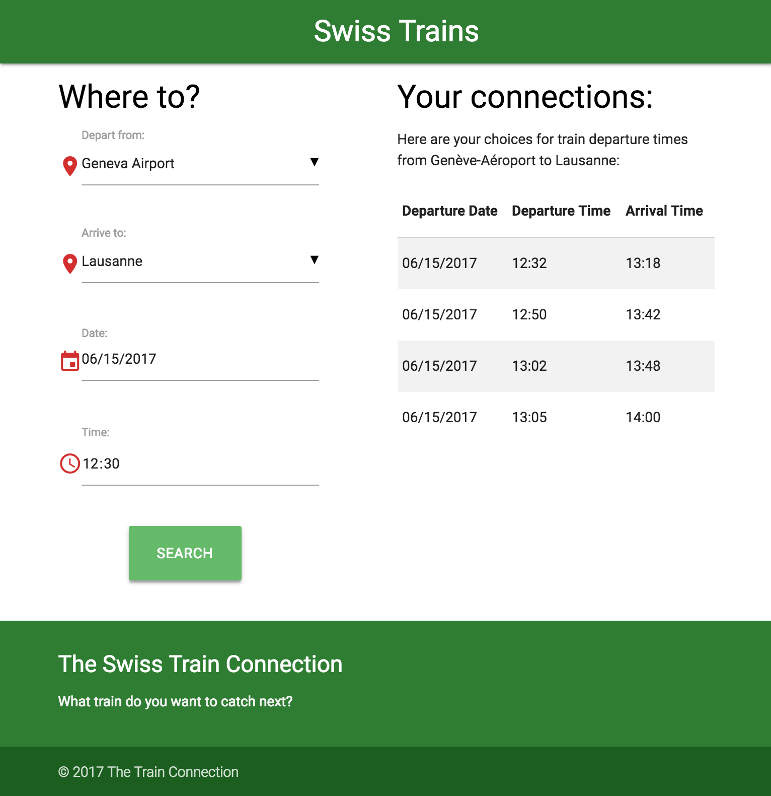

# Q1 Project - Look up Swiss Train Connections

"The Swiss Train Connection".

This front end app will check what trains the user can take in Switzerland, to go from one train station to another. Imagine a person not familiar with that country who is going on a business trip there.

The main user story is: "As a traveler going to Switzerland, I want to see what train connections there are, so that I can plan my upcoming trip".

**Input**: Two train stations (usually cities), date and time.

**Output**: The next few train connections between those cities, after the time from user.

## Implementation

It uses API http://transport.opendata.ch. Fetch() and Promises are used to connect with the API. UI in Materialize.
